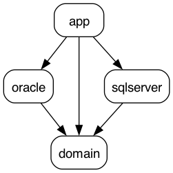

# Hexagonal Architecture Example with Java 17 and String Boot

## Overview

This is a small Java application example showcasing the Hexagonal Architecture (also known as the Ports and Adapters
Architecture) design pattern. Hexagonal Architecture emphasizes modularity and separation of concerns, making it a
suitable choice for building maintainable and testable applications.

## Architecture Overview

## Modules

### **domain**

This module represents the core domain logic of your application.
Define models and business logic here.
Ensure that this module has no dependencies on external frameworks or technologies.

### **dataaccess**

Implements the ports defined in the domain-core module.
Provides concrete implementations for data storage, such as databases.
Adapters to external systems or databases belong here.

### **app**

The main application module that configures and runs the application.
Contains the main class with public static void main to start the application.
Configures Spring Boot and initializes the Spring application context.